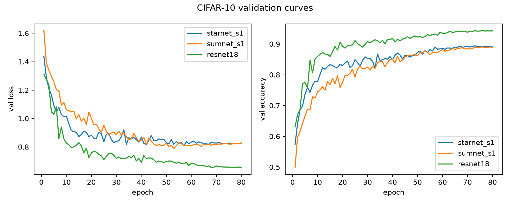
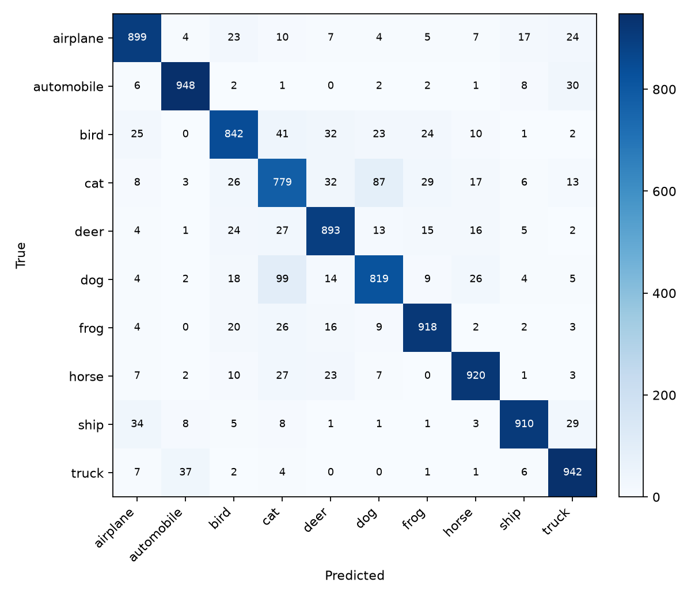
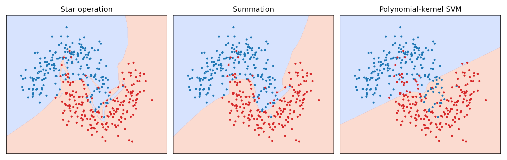

# Pattern Recognition — AI Assignment 1

**Student:** Rico Ip  
**Date:** September 2026  
**Algorithm:** StarNet (Ma et al., CVPR 2024)  
**Task:** CIFAR-10 image classification  

---

## 1. Assignment interpretation

The brief asked for a recent Deep CNN or Deep Autoencoder with a computer-vision / pattern-recognition application. An AI tool or agent was expected to search, program, and write the report. The student was not allowed to write code by hand. The Moodle submission is this report, which must describe the steps actually taken.

This repository is the working product of that process: a StarNet reproduction trained on CIFAR-10, two control models, plots, and this write-up.

## 2. How the AI agent was used

The work was done in Grok Build (xAI), in the local folder `hw01`. The sequence was:

1. **Read the brief.** The agent opened `AIassign1.pdf` and extracted the requirements above.
2. **Search for a paper.** Web and arXiv lookups were used for recent Deep CNNs and Deep Autoencoders (2023–2025). ConvNeXt V2 + FCMAE was considered because it is both a CNN and a masked autoencoder. It was dropped: the official encoder needs MinkowskiEngine sparse convolutions, which is a poor fit on macOS / Apple MPS.
3. **Select StarNet.** *Rewrite the Stars* (Ma, Dai, Bai, Wang, Fu; CVPR 2024) is a Deep CNN. The star operation (element-wise product of two linear projections) is argued to act like a polynomial kernel. That link is useful in a pattern-recognition course.
4. **Check the machine.** Anaconda `base` was Python 3.14.7 with no PyTorch. `pip3 install torch torchvision` installed torch 2.14.0 and torchvision 0.29.0. MPS worked (`mps:0`).
5. **Write the code.** The agent implemented StarNet from the official `starnet.py`, a sum ablation (SumNet), a CIFAR-adapted ResNet-18, training/eval scripts, and a 2D moons visualization. The student did not edit source files.
6. **Train.** Three 80-epoch runs on CIFAR-10, then test evaluation and plots.
7. **Write this report** from the logs in `results/`, not from the paper’s ImageNet numbers.
8. **Git.** `git init`, ignore `AIassign1.pdf`, first commit of the source after git config was set by the student.

No code in `src/` was typed by the student.

## 3. Why StarNet

StarNet is a four-stage hierarchical ConvNet. Each block does:

```
x = DWConv7(x)
x = ReLU6(f1(x)) * f2(x)   # star operation
x = DWConv7(g(x))
x = x + residual
```

Rewriting `(W1^T x) * (W2^T x)` expands into about `(d+1)(d+2)/2` implicit pairwise terms. That is the same shape as a degree-2 polynomial kernel, computed in the original width. Stacking blocks grows that implicit dimension exponentially. The paper’s control is the same block with `*` replaced by `+`.

This assignment uses that control (SumNet-S1) and a larger familiar CNN (ResNet-18) on CIFAR-10.

## 4. Implementation notes

- **Faithfulness.** Block layout, 7×7 depthwise convs, ReLU6 on one branch, expansion 4, and the S1 widths/depths `[2,2,8,3]` with base width 24 follow [ma-xu/Rewrite-the-Stars](https://github.com/ma-xu/Rewrite-the-Stars). `DropPath` is inlined so `timm` is not required.
- **CIFAR stem.** ImageNet StarNet uses stem stride 2 on 224×224 images. Here the stem stride is 1, so 32×32 inputs are not immediately quartered. Stages still downsample 32→16→8→4→2.
- **SumNet.** Identical graph; only `*` becomes `+`.
- **ResNet-18.** torchvision ResNet-18 with a 3×3 stride-1 conv and no max-pool, the usual CIFAR stem. It is a stronger but much larger baseline, not a matched-capacity one.
- **Device.** Apple M2 Pro, PyTorch MPS.
- **Recipe.** AdamW, lr `3e-3`, weight decay `0.05`, cosine decay with 5-epoch warmup, batch 128, label smoothing 0.1, random crop + flip. 45k/5k train/val split from the CIFAR-10 training set; final numbers are on the 10k test set.

## 5. Results

All three models were trained for 80 epochs from scratch.

| Model | Params | MACs (32×32) | Best val | Test (best ckpt) | Wall time |
|---|---:|---:|---:|---:|---:|
| StarNet-S1 | 2.67M | 34.4M | 89.41% (ep. 73) | **88.70%** | 44.3 min |
| SumNet-S1 | 2.67M | 34.4M | 89.04% (ep. 76) | 88.41% | 42.9 min |
| ResNet-18 | 11.17M | 555.4M | 94.34% (ep. 76) | 94.01% | 70.1 min |

StarNet beats the matched-capacity sum ablation by **0.29** percentage points on test. That is the same direction as the paper, but a much smaller gap than their ImageNet DemoNet tables. Possible reasons: CIFAR-10 is easier and lower-resolution; 80 epochs is far short of the paper’s 300-epoch ImageNet recipe; S1 is already wide enough that the implicit-dimension benefit is partly saturated (the paper itself reports a shrinking star-vs-sum gap as width grows).

ResNet-18 is clearly stronger, at roughly **4×** the parameters and **16×** the MACs. It is a reference point, not evidence that the star operation failed.



*Figure 1. Validation loss and accuracy for StarNet-S1, SumNet-S1, and ResNet-18.*



*Figure 2. StarNet-S1 confusion matrix on the CIFAR-10 test set.*

Per-class test accuracy (StarNet): automobile 94.8%, truck 94.2%, horse 92.0%, frog 91.8%, ship 91.0%, airplane 89.9%, deer 89.3%, bird 84.2%, dog 81.9%, cat 77.9%. Cat/dog/bird are the weak classes for all three models.



*Figure 3. 2D noisy-moons decision boundaries: star MLP, sum MLP, and a cubic polynomial SVM (qualitative, after Figure 2 of the paper).*

## 6. Limitations

- CIFAR-10, not ImageNet-1K.
- 80 epochs, not 300.
- No ImageNet pretraining or distillation.
- Star vs sum gap is small; a single seed.
- ResNet-18 is not capacity-matched.
- Official FCMAE / ConvNeXt V2 was not implemented.

## 7. Conclusion

A CVPR 2024 Deep CNN, StarNet, was located, implemented, and trained on CIFAR-10 using an AI agent end-to-end. The star operation slightly outperformed an otherwise identical sum network (88.70% vs 88.41% test). A larger ResNet-18 reached 94.01%. The code, logs, and figures in this repository are the audit trail for that process.

## References

1. Xu Ma, Xiyang Dai, Yue Bai, Yizhou Wang, Yun Fu. Rewrite the Stars. CVPR 2024. https://arxiv.org/abs/2403.19967
2. Official code: https://github.com/ma-xu/Rewrite-the-Stars
3. Kaiming He, Xiangyu Zhang, Shaoqing Ren, Jian Sun. Deep Residual Learning for Image Recognition. CVPR 2016.
4. Alex Krizhevsky. Learning Multiple Layers of Features from Tiny Images. 2009. (CIFAR-10)
5. Sanghyun Woo et al. ConvNeXt V2: Co-designing and Scaling ConvNets with Masked Autoencoders. 2023. (considered, not implemented)

## Appendix

**Environment:** macOS, Apple M2 Pro, Anaconda Python 3.14.7, torch 2.14.0, torchvision 0.29.0, device `mps`.

**Commands:**

```
pip3 install -r requirements.txt
python src/train.py --model starnet_s1
python src/train.py --model sumnet_s1
python src/train.py --model resnet18
python src/evaluate.py --model starnet_s1
python src/evaluate.py --model sumnet_s1
python src/evaluate.py --model resnet18 --compare
python src/visualize_2d.py
```

**Layout:** `src/models/starnet.py` (model), `src/train.py`, `src/evaluate.py`, `src/visualize_2d.py`, `configs/cifar10.yaml`, `results/{model}/`, `report/figures/`.
